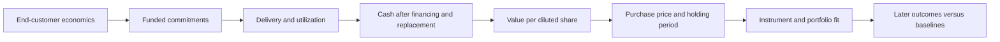

# Assumptions, thresholds and the bigger picture

Review: September 12, 2026. The reproducible population is the September 11
tracker, generated at 16:29:02 Mountain, with its saved edge and conviction
artifacts. Research only; this is an implementation and measurement audit,
not a current quote sheet, return forecast or trade recommendation.

## The central judgment

The desk has useful research coverage and several layers of capital protection.
Its weakest link is the connection between a broad industry thesis and verified
per-share investment outcomes. More score agreement does not resolve that gap:
many of the scores reuse the same inputs, and some penalties measure missing
research coverage or the method used to assemble data rather than company risk.

We should measure the whole investment chain:

The operating hypothesis is that infrastructure investment creates attractive
opportunities at several stages. The stock hypothesis must explain which
company retains the economics and how much is already priced in. The instrument
must fit the timeline. Option value also depends on strike, remaining time and
volatility, so a business thesis alone does not settle an option decision.
[OIC option price behavior](https://www.optionseducation.org/referencelibrary/faq/option-price-behavior).

## What this cleanup repaired

The [frozen comparison](../outputs/assumption-audit-2026-09-11/results.json)
reproduces all six saved score/action/grade/flag fields for all 183 names before
evaluating the repairs. Every tracker row is retained.

| Issue | Implemented correction | Observed current effect |
|---|---|---|
| Context zero treated as false and replaced by tracker/default input | Preserve zero RVOL, zero ATR expansion, zero distance to support/resistance; only absent context allows tracker fallback | No zero-context cases in this snapshot; boundary regression tests exercise the defect |
| Nonpositive P/E still earns favorable credit in conviction fallback quality/value | Reject nonpositive/nonfinite/invalid P/E as meaningful earnings valuation; retain the existing missing-P/E buckets and valid linked edge scores | No affected current fallback rows; 26 fallback rows already lack P/E |
| Past earnings offsets can enter conviction near-term/options lists | Require a finite, nonnegative supplied offset within the existing 30/45-day windows | No current membership changes; past/invalid and valid boundary tests pass |
| Nonfinite or Boolean numerics can behave as measurements | Parse finite numeric observations; expose missing/invalid status for reviewed input fields | No current score changes |
| Agreement described as independent confirmation; old macro references asserted a current strong regime | Label overlapping scores and dated regime references honestly; ownership wording now asks for milestones, valuation and portfolio fit | Report semantics corrected; weights unchanged |
| Threshold audit recommends a percentile quota as if it were validated | Report selectivity as a descriptive comparison; require future outcome evidence before substitution | Existing cutoff preserved |
| Missing wide-spread flag described as a full liquidity/risk pass | Describe the flag difference and trace actual downstream gates | Existing risk policy already handles thin/no-liquid-contract conditions; no gate repair was needed |

Result: **zero current score, action, grade or flag changes**, identical top-20
membership/order and unchanged near-term/options list membership. This is a
verified prevention of boundary errors, not evidence of improved returns.
The existing missing-input scoring buckets are still heuristics; using them for
nonmeaningful P/E does not establish that unknown quality is poor quality.

Implementation: [conviction](../inferno_conviction_research.py),
[threshold audit](../inferno_score_threshold_audit.py).

## Where our view remains distorted

### Data provenance is too coarse for the penalty it drives

All 183 saved market-context rows have `sourceStatus=fallback`. However, 179
carry a watchlist pulse labelled `schwab-price-history`, with a saved source bar
timestamp of `2026-09-10T05:00:00+00:00`; four have no attached pulse.
Those timestamps are preserved as provider bar labels, not converted here into
proof of a completed exchange session. A September 11 report build cannot make
that daily observation current or executable.

The [row context builder](../inferno_tos_formula_math.py) sets `fallback` for
ordinary usable tracker rows regardless of whether their attached metrics were
recomputed from Schwab history. The [provenance projection](../outputs/assumption-audit-2026-09-11/provenance.json)
records this distinction. The label alone cannot tell us which *consumed*
RVOL, level, ATR or trend fields are direct observations, older values, or
synthetic proxies. Attached history fields are not proof every scoring input
was built from those fields.

Conviction currently applies an 8-point source penalty to `fallback`, uses it
inside the evidence pillar and includes a fallback risk flag (which can add
another penalty). All names share the label in this snapshot. This is a
compound assumption, not independent confirmation of poor data. Do not simply
rename all rows `history`: that would raise confidence without verifying inputs.
Required next repair: field-level origin, raw value, transformation, observation
time, session completeness and a visible default flag, followed by a frozen
impact comparison before changing any numerical confidence treatment.

### Visibility is broader than fundamental coverage

The tracker and conviction artifact retain 183 names. Only 40 have linked edge
research in this frozen cycle; 143 use some tracker/theme fallbacks. Of those,
124 receive the explicit missing-edge penalty (the function exempts its giant
and category-override lists). This is a research-coverage penalty, not evidence
that those 124 businesses are worse. The industry report's visibility repair
does not replace the scoring taxonomy or supply full issuer diligence.

### Seven pillars are not seven independent signals

| Underlying information | Reused by |
|---|---|
| Readiness, priority, confidence, signal trigger, earnings offset | Edge timing, conviction timing; confidence also contributes to conviction evidence; trigger affects uncertainty/action routing |
| RVOL, trend, ATR expansion, support/resistance | Edge confirmation, conviction structure, options/ownership components and risk flags |
| Edge score | Conviction evidence; edge itself already blends theme, timing, confirmation, quality and valuation |
| Tracker long-term score | Edge valuation, fallback conviction valuation and direct ownership component |
| Quality, valuation and theme | Both near-term and ownership composites; selected constituents are blended again through balance/evidence adjustments |

For example, without linked edge valuation, tracker long-term score contributes
22% directly to ownership conviction and another 13.2% through valuation
(22% valuation weight × 60% tracker-score weight), or **35.2% total** before any
other shared-input relationships. That is arithmetic attribution, not a causal
estimate or a claim the weight is optimal.

The raw `gutCheckScore` orders the durable ranking; `bestBalanced` orders its
section by adjusted conviction. Different list leaders need not be a bug:
they answer different questions. The score names and intended uses must remain
visible rather than being blended into one vague idea of confidence.

## What the thresholds actually do

This table is a **single-predicate** comparison on the frozen 183-name universe.
It does not count tickets, successful trades, or names passing all gates.

| Measurement | Cutoffs and names meeting each | Interpretation |
|---|---|---|
| Tracker readiness | >=68: 94; >=72: 86; >=80: 62; >=85: 47; >=90: 28 | The same cutoff changes selectivity as the distribution changes |
| Adjusted conviction | >=56: 13; >=62: 3; >=68: 1; >=72: 0 | This composite includes source, coverage and risk-flag penalties |
| Ownership conviction | >=66: 30; >=70: 19; >=72: 12 | Ownership opportunity is a different question from imminent earnings |

Readiness 72 and adjusted conviction 72 are different scales with different
inputs. Their radically different counts do not establish that one is too
strict. A full admission path requires all of its predicates and downstream
checks. Likewise, `readyRank` is a percentile policy reference while readiness
is a fixed score; the same numerical labels are not interchangeable.

| Rule family | Current disposition | Evidence needed to change it |
|---|---|---|
| Human order authority; approved-account scope; risk constants | Preserve | Explicit operator policy; no threshold experiment changes authority |
| Quote identity, timestamps, full paired payoff, funds and correlated exposure | Preserve purpose and current implementation | Reproduced data/logic defect or separately reviewed policy proposal |
| 21-day edge catalyst window; 30/45-day conviction lists | Preserve as declared event-lane horizons | Verified dates and a separate ownership/milestone path; no universal earnings clock |
| Readiness, edge, adjusted conviction and letter-grade cutoffs | Unvalidated hypotheses | Later net outcomes against fixed baselines on the same population |
| RVOL thresholds and daily ATR/premium comparisons | Unit/session/tenor audit required | Completed-session or validated same-time volume; matched option and realized-move horizon |
| Growth credit capped at 50%; category scores; missing-edge/source penalties | Unvalidated transforms/priors | Raw-feature provenance plus incremental value after sector and exposure controls |
| Top-percentile target | Descriptive policy reference, not evidence of better selection | Same-universe future comparison; no fixed number of trades required |
| 30 qualifying paper outcomes | Minimum evidence gate, not proof by count alone | Outcome provenance plus expectancy, payoff, downside and other existing checks |

The current calibration report still labels all 907 closed option archive rows
`legacy-entry-unverified`; 904 are shadow and three paper. Repeated ticker and
expiration exposure further limits independence. Its model-fitting flag remains
false. These archive counts are not the qualified promotion sample and must not
be used to fit a more attractive cutoff. Source: September 11, 21:42:28 Mountain
[calibration report](../reports/score_calibration_latest.txt), recorded in the
companion evidence snapshot.

## Next research decisions, in order

1. **Trace provenance before changing confidence.** Audit the actual RVOL,
   support/resistance and ATR fields consumed by scores against their provider
   bars. Falsifier: if every consumed field already has verified origin and
   session semantics, the problem is labelling/penalty design rather than data
   ingestion. Capture rejected/missing rows too.
2. **Test business economics on consistent horizons.** Apply the existing
   supplier/developer valuation framework to comparable candidates: funding,
   delivery, replacement spending, margins and dilution. Keep a delay/funding
   scenario and a demanding-entry-price scenario. Good business news alone
   must not become a buy signal.
3. **Predeclare a longer-horizon comparison.** Compare current ranking with a
   simple peer/sector-momentum baseline and a separately specified fundamental
   challenger. Freeze the same eligible universe, score source, selection
   rule, observation date, holding period and costs before viewing outcomes.
   Use 63-session stock returns as a proposed primary diagnostic horizon and
   21/126-session sensitivity views, with no reuse of those views for tuning.
   These are proposed research evaluation periods, not adopted trade horizons.
   Keep all names, including unselected/missing ones, and count both missed
   winners and newly admitted losses using a frozen definition. Missing costs
   or benchmark history block claims of net advantage, not visibility.
4. **Judge value rather than activity.** Report benchmark-relative outcome,
   downside, turnover, concentration, costs, independent events and uncertainty.
   Choose practical acceptance criteria before results; use a later untouched
   period after any revision. Do not call an improved candidate count an edge.

Trying many thresholds on the same history can select noise. The research
protocol must retain the number of alternatives tested and guard against
repeated use of the evaluation sample. A holdout label alone does not solve
multiple testing. [Bailey et al., The Probability of Backtest Overfitting](https://www.davidhbailey.com/dhbpapers/backtest-prob.pdf).

## Verification and limits

Focused numeric/list/report regressions pass. The broader repository suite,
math invariants, secret hygiene and final diff checks are recorded in
[validation.json](../outputs/assumption-audit-2026-09-11/validation.json).
The frozen comparison and corrected source reproduce exactly. Protected-file
hashes cover risk, authority, allocator, production edge rules, calibration and
the paper ledger. No trading risk limit, eligible universe, operator ticket
decision or submission authority was changed.

No new qualified paper outcome, calibrated probability, optimized cutoff or
realized investment return is claimed. The next research comparison is specified
as a priority, not falsely reported as a completed forward test.
