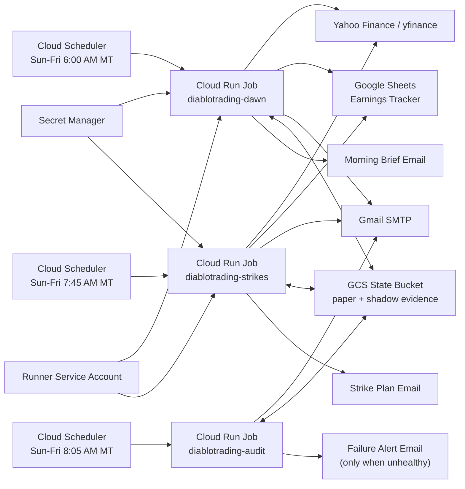

# Cloud Automation Runbook

This moves the morning brief from a Mac `launchd` job to a Google Cloud hosted runner.

## Why Cloud Run Jobs

The local runner depends on the Mac being powered on, awake, and logged in because `launchd` user agents run inside the user session. Google Cloud removes that dependency:

- Cloud Scheduler owns the 6 AM Mountain trigger.
- Cloud Run Jobs run the Python pipeline in a container.
- A second Cloud Run Job refreshes strike tickets after options markets open.
- A third Cloud Run Job audits the cloud lane and only alerts when something breaks.
- A private GCS state bucket restores and persists paper/shadow evidence across stateless Cloud Run executions.
- Secret Manager stores SMTP and Google service-account credentials.
- A dedicated Cloud Run runner service account reads secrets.
- A separate scheduler service account can only invoke the dawn job.
- The local Mac LaunchAgent can remain as a fallback until the cloud job proves itself.

Current deployment note:

- The cloud lane now supports a fallback `SECRET_DELIVERY_MODE=plain-env` when
  the operator service account can deploy jobs but cannot change Secret Manager
  IAM or Cloud Run Job IAM policies.
- In the current project, Cloud Run jobs run as
  `ohsheetbot@ohsheetohsheet.iam.gserviceaccount.com`, so Google Sheets access
  uses the ambient Cloud Run service account identity instead of shipping the
  tracker key JSON into the container.
- SMTP is still injected as an env var in the current fallback path because the
  deploy identity cannot grant Secret Manager accessor roles.

Official docs:

- [Cloud Run Jobs](https://cloud.google.com/run/docs/create-jobs)
- [Cloud Scheduler](https://cloud.google.com/scheduler/docs)
- [Cloud Run secrets](https://cloud.google.com/run/docs/configuring/services/secrets)

## Architecture



## What Changes

The cloud job uses:

- `morning_inferno_pipeline.py --cloud-native`
- `cloud_strike_cycle.py` for the post-open strike refresh
- `inferno_cloud_execution_auditor.py --alert-on-failure` for exception-only monitoring
- `inferno_cloud_state.py` for GCS artifact restore/persist
- `inferno_paper_execution.py` for the paper-only strike ledger
- `GOOGLE_SERVICE_ACCOUNT_JSON` from Secret Manager
- SMTP env vars from `.env.smtp` copied into Cloud Run
- `SMTP_PASSWORD` from Secret Manager
- `INFERNO_CLOUD_STATE_BUCKET` for persistent paper/shadow evidence state

If the Cloud Run service account already has access to the tracker sheet, the
pipeline can also use ambient Google credentials and does not require
`GOOGLE_SERVICE_ACCOUNT_JSON` at runtime.

It does **not** need:

- PyCharm open
- the Mac awake
- the local Backtest folder
- the macOS wake schedule

## One-Time Prerequisites

1. Install the Google Cloud CLI.
   Safe local helper:

```bash
./scripts/bootstrap_cloud_operator.sh status
./scripts/bootstrap_cloud_operator.sh install
```

This installer keeps the Cloud SDK in `~/.local/google-cloud-sdk` and links
`gcloud`, `gsutil`, and `bq` into `~/.local/bin` instead of spraying files into
system locations.

2. Authenticate:

```bash
./scripts/bootstrap_cloud_auth.sh status
./scripts/bootstrap_cloud_auth.sh login
./scripts/bootstrap_cloud_auth.sh adc
```

If you prefer the non-browser path and your service-account JSON already belongs
to the deployment project, you can activate it directly:

```bash
./scripts/bootstrap_cloud_service_account.sh status
./scripts/bootstrap_cloud_service_account.sh activate
```

3. Select or create the Google Cloud project:

```bash
gcloud config set project <project-id>
```

4. Confirm local secrets exist:

```bash
test -f "$HOME/PycharmProjects/Backtest3.0/gcred.json"
test -f ".env.smtp"
```

The Google service account in `gcred.json` must already have access to the `Earnings Tracker` Google Sheet.

The deploy script creates or reuses a state bucket named
`<project-id>-inferno-state` unless `CLOUD_STATE_BUCKET` is set. If bucket
creation is blocked by IAM, the script falls back to the existing
`<project-id>_cloudbuild` bucket so paper/shadow evidence can still persist
between Cloud Run executions.

5. Verify the operator machine is really cloud-ready:

```bash
./run_inferno_cloud_control_plane.sh
```

6. Verify the cloud lane actually ran and preserved evidence:

```bash
./run_inferno_cloud_execution_audit.sh
```

This is the proof layer after deployment. It checks the latest Cloud Run
executions, expected email success logs, enabled schedulers, and required GCS
state artifacts without reading or storing any Cloud Run secret values.

If you want the auditor to behave like a quiet operations sentry, run:

```bash
./run_inferno_cloud_execution_audit.sh --alert-on-failure
```

That mode only emails when the audit is unhealthy and throttles repeat alerts
to one per day for the same failure pattern.

## Deploy

From the repo root:

```bash
./scripts/deploy_cloud_run_job.sh
```

Optional environment overrides:

```bash
PROJECT_ID="your-project-id" \
REGION="us-central1" \
JOB_NAME="diablotrading-dawn" \
SCHEDULE="0 6 * * SUN,MON,TUE,WED,THU,FRI" \
./scripts/deploy_cloud_run_job.sh
```

The deploy script will:

- enable required APIs
- create an Artifact Registry Docker repo if needed
- upload the Google Sheets service-account JSON to Secret Manager
- upload the SMTP app password to Secret Manager
- build the Cloud Run image
- create a dedicated Cloud Run runner service account
- grant the runner Secret Manager read access for only the required secrets
- deploy the Cloud Run Job with the runner identity
- deploy a second strike-selection Cloud Run Job at 7:45 AM Mountain
- create a scheduler service account with job-invoker permission only
- create/update the Cloud Scheduler triggers at 6:00 AM, 7:45 AM, and 8:05 AM Mountain, Sunday through Friday

If Cloud IAM is more restrictive than expected:

- `SECRET_DELIVERY_MODE=auto` will try Secret Manager first, then fall back to
  inline env delivery for the runtime secrets.
- `SECRET_DELIVERY_MODE=plain-env` skips Secret Manager IAM work and uses
  inline env delivery directly.
- If the deploy identity cannot update Cloud Run Job IAM, the script falls back
  to using the active deploy service account as the Cloud Scheduler caller.

## Manual Cloud Test

```bash
gcloud run jobs execute diablotrading-dawn \
  --region us-central1 \
  --wait
```

Manual strike-ticket test:

```bash
gcloud run jobs execute diablotrading-strikes \
  --region us-central1 \
  --wait
```

Success means the job logs show:

- `Morning inferno pipeline complete.`
- `Email sent: yes`

Strike job success means the logs show:

- `Inferno Strike Plan`
- `Inferno Paper Execution Ledger`
- `Strike email sent: yes`

After running both jobs manually, run:

```bash
./run_inferno_cloud_execution_audit.sh
```

The audit writes:

- [data/inferno_cloud_execution_audit.json](data/inferno_cloud_execution_audit.json)
- [reports/cloud_execution_audit_latest.txt](reports/cloud_execution_audit_latest.txt)

## Local Cloud-Native Smoke Test

This uses the same internal updater path the cloud job uses, but runs locally:

```bash
./scripts/run_cloud_native_local.sh --skip-email
```

Remove `--skip-email` when you want to send a real test email.

## Cutover Plan

Run both systems for two successful mornings:

1. Cloud job sends the morning brief.
2. Local LaunchAgent sees a successful send and skips duplicates.
3. `python3 inferno_doctor.py` remains healthy.

After two clean mornings, uninstall the local service if desired:

```bash
python3 install_inferno_dawn_service.py uninstall
```

## Rollback

If cloud breaks, leave the local service installed and run:

```bash
./run_inferno_dawn_cycle.sh
```

The local path still uses the Backtest virtualenv and original BC/P/Q/R scripts.
